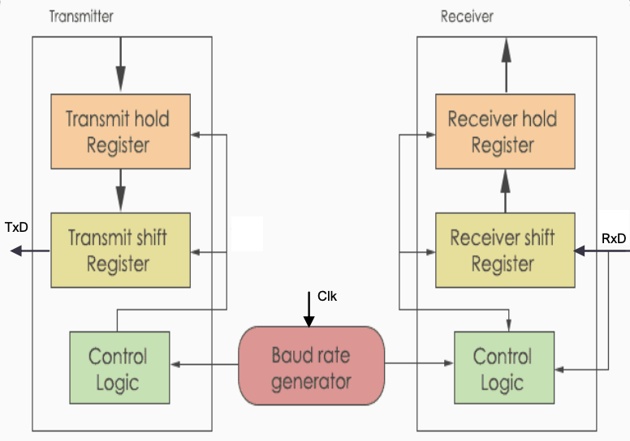
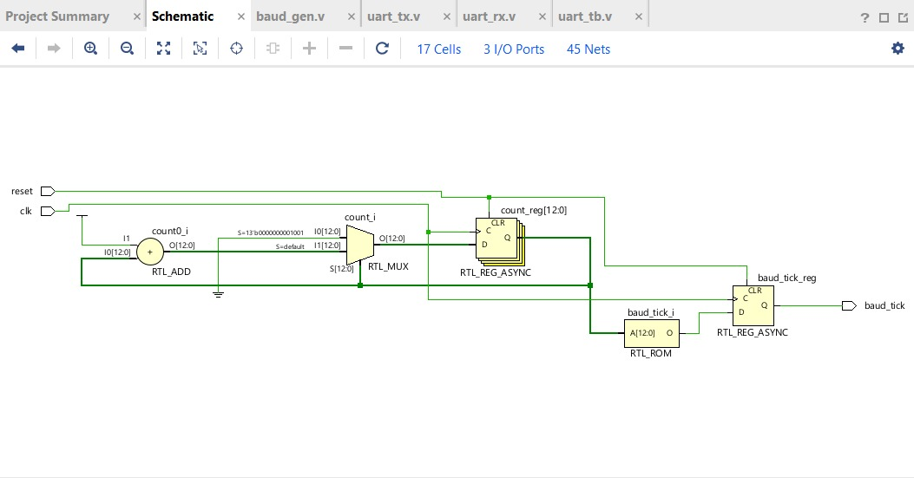
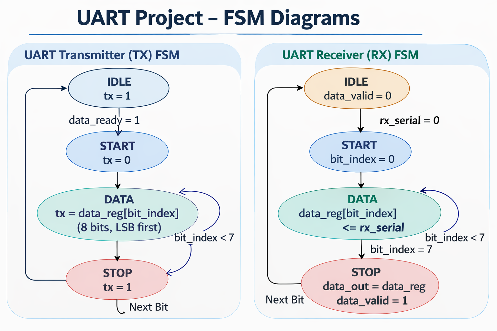

# UART-Verilog-FSM
# UART Transmitter and Receiver using Verilog (FSM Design)

## Overview

This project implements a **Universal Asynchronous Receiver Transmitter (UART)** using **Verilog HDL**.
The design consists of a **Baud Rate Generator, UART Transmitter, and UART Receiver** implemented using **Finite State Machines (FSM)**.

The design is simulated and synthesized using **Xilinx Vivado**.

---

# Architecture

The UART system consists of three main modules:

1. Baud Rate Generator
2. UART Transmitter
3. UART Receiver

Baud generator provides the timing signal (`baud_tick`) used by both TX and RX modules.

---

# Block Diagram



---
# Circuit Diagram



---

# FSM Design

UART transmitter and receiver operate using FSM states:

```
IDLE → START → DATA → STOP → IDLE
```



---

# RTL Modules

### Baud Rate Generator

Generates periodic baud tick for UART timing.

```
baud_gen.v
```

### UART Transmitter

Converts 8-bit parallel data to serial stream.

States:

* IDLE
* START
* DATA
* STOP

```
uart_tx.v
```

### UART Receiver

Receives serial data and reconstructs 8-bit parallel data.

States:

* IDLE
* START
* DATA
* STOP

```
uart_rx.v
```

---

# Testbench

The testbench connects TX output to RX input and verifies successful data transmission.

```
uart_tb.v
```

---

# Simulation Result

UART data transmission verified in Vivado simulator.


---

# Synthesis Results

RTL schematic generated by Vivado.


Device utilization and implementation view.


---

# Power Analysis

Total On-Chip Power

```
0.448 W
```

---

# Tools Used

* Verilog HDL
* Xilinx Vivado
* FPGA synthesis tools

---

# Applications

UART is widely used in:

* FPGA communication
* Embedded systems
* Microcontroller interfaces
* Serial communication protocols

---

# Author

**Gayathri Wagdevi**
ECE Student
KL University
